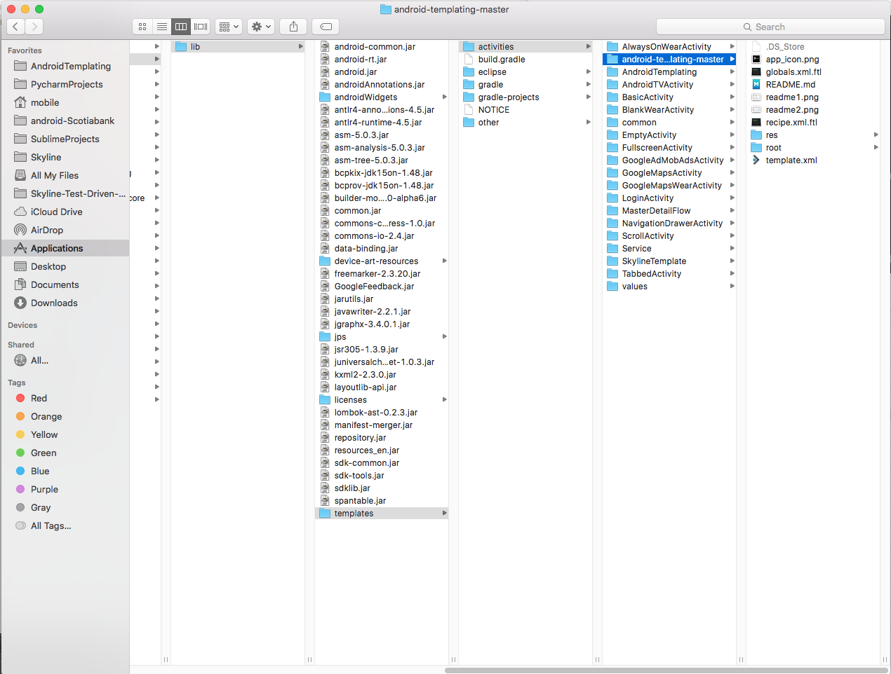

Skyline Android Studio Template
==================================

# Installation
### For Mac:

Just copy SkylineMvpTemplate Folder to `$ANDROID_STUDIO_FOLDER$/Contents/plugins/android/lib/templates/activities/`

### For Windows:
Just copy SkylineMvpTemplate Folder to `$ANDROID_STUDIO_FOLDER$\plugins\android\lib\templates\activities\`

# Using it

# Editing it

Wanna make your own or edit it? `http://crypto.nknu.edu.tw/AOSP/AOSP/sdk/templates/docs/`

[u2020-mvp]: https://github.com/LiveTyping/u2020-mvp
[AndroidIDE]: http://crypto.nknu.edu.tw/AOSP/AOSP/sdk/templates/docs/
[FreeMarker]: http://freemarker.incubator.apache.org